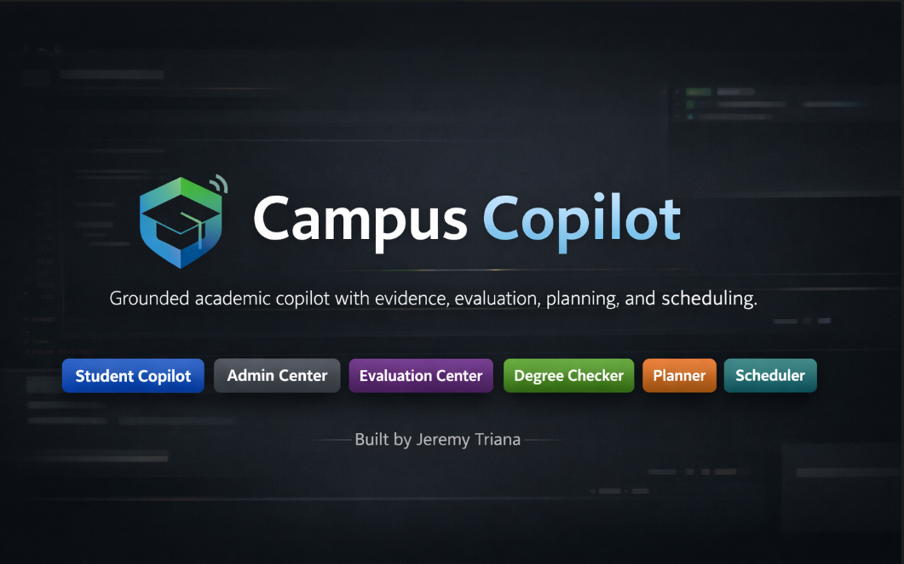

# Campus Copilot

<p align="center">
  
</p>

<p align="center">
  <strong>Grounded academic assistant for advising Q&A, degree checking, term-by-term planning, and schedule validation using official university documents and deterministic rules.</strong>
</p>

<p align="center">
  <a href="https://github.com/Jeremytriana811/campus-copilot/actions/workflows/ci.yml">
    
  </a>
  
  
  
</p>

## Overview

Campus Copilot is a grounded academic copilot built to answer university advising questions from official school documents while keeping degree checking, planning, and scheduling deterministic and auditable.

Instead of acting like a generic chatbot, the project separates:
- **document-backed question answering**
- **structured academic rules**
- **deterministic planning and schedule validation**

That makes the system safer, easier to test, and easier to explain in interviews.

## Why this project matters

Many academic assistants fail because they try to use one chat model for everything.

Campus Copilot takes a more reliable approach:

- **RAG** for supported advising and policy questions
- **Evidence + refusal behavior** instead of pretending to know everything
- **Structured rules** for degree audits and planning
- **Deterministic logic** for schedule conflict checks
- **Logging and evaluation** so quality can be inspected instead of guessed

This makes the project feel more like a real platform than a simple AI demo.

## Core Features

- Ingests official catalogs, flowcharts, and advising documents into a local retrieval pipeline
- Answers supported questions with evidence from source documents
- Refuses unsupported or weakly supported questions
- Provides a **Student Copilot** workspace for grounded advising Q&A
- Provides an **Admin Center** for ingestion, logs, and diagnostics
- Provides an **Evaluation Center** for offline pass/fail checks
- Checks degree progress using structured program requirements
- Builds deterministic term-by-term course plans
- Validates schedule conflicts using deterministic logic
- Includes automated tests and GitHub Actions CI

## Current Workspaces

### Student Copilot
- Grounded answer flow
- Evidence panel with document/page support
- Refusal behavior for unsupported queries
- Retrieval debug view for inspecting search results

### Admin Center
- School pack summary
- Ingestion trigger
- Recent ingestion runs
- Recent logs and diagnostics

### Evaluation Center
- Offline evaluation suite
- Pass/fail summary
- Grounded answer count
- Correct refusal count

## Architecture


## Tech Stack

- **Language:** Python
- **UI:** Streamlit
- **Retrieval / Vector DB:** Chroma
- **Embeddings:** sentence-transformers
- **Document parsing:** PyPDF
- **Structured storage:** SQLite
- **Testing:** pytest
- **CI:** GitHub Actions
- **Version control:** Git + GitHub

## Engineering Design Choices

### 1. Retrieval and planning are separated
Document-backed Q&A is probabilistic, but degree checking, planning, and scheduling should follow explicit rules.

### 2. Refusal is a feature
If evidence is weak or missing, the system should refuse instead of hallucinating.

### 3. Structured rules matter
Degree progress, milestones, and sequencing are implemented with explicit academic logic rather than free-form generation.

### 4. Evaluation comes before “smartness”
The project includes offline evaluation and logs so quality can be measured and improved over time.

### 5. Local-first, cloud-ready
The current version is intentionally local-first for simplicity and control, while keeping the architecture easy to extend later.

## Project Structure

```text
campus-copilot/
  app/
    admin/
    core/
    eval/
    planner/
    rag/
    scheduler/
    school_packs/
    storage/
  docs/
  school_packs/
  screenshots/
  tests/
  streamlit_app.py
  README.md
```

## How to Run

### 1. Install dependencies
```bash
pip install -r requirements.txt
```

### 2. Run tests
```bash
python -m pytest -q
```

### 3. Launch the app
```bash
python -m streamlit run streamlit_app.py
```

## What Is Implemented

- School pack loading
- PDF ingestion and chunking
- Chroma-based retrieval
- Grounded response flow
- Evidence display
- Refusal behavior
- Admin ingestion workflow
- Evaluation workflow
- Structured degree checker
- Deterministic planner foundation
- Scheduler conflict checker
- Test coverage and CI

## Known Limitations

- Retrieval quality is still mixed for some prerequisite-heavy questions
- Requirement modeling is still partial and does not cover every university-wide rule
- Planner is deterministic but still simplified
- Scheduler currently validates conflicts, but does not yet optimize among many section combinations
- Retrieval is currently dense-first and does not yet include hybrid search
- The current version is local-first and does not yet use a hosted cloud search or model backend

## Future Improvements

### Retrieval / RAG
- Add **hybrid retrieval** (dense + keyword / BM25)
- Add **re-ranking** after retrieval
- Improve chunking strategy using evaluation results
- Add better snippet selection for citations
- Improve extraction quality for weaker PDFs

### Performance
- Add caching for repeated questions
- Speed up embedding generation with optimized inference backends
- Try quantized embeddings for lower memory use and faster search
- Add async ingestion for larger document packs
- Tune the retrieval/index layer for faster similarity search

### Evaluation
- Expand the offline evaluation suite to 20–50 curated advising questions
- Track retrieval quality by question category
- Add regression-style evaluation for future changes
- Measure latency, refusal correctness, and citation usefulness over time

### Product
- Add a cleaner chat-style Student Copilot interface
- Add exportable plans and schedule summaries
- Add richer admin diagnostics and filtering
- Improve multi-school support and metadata
- Add a short hosted demo or deployment later

### Planning / Scheduling
- Add deeper prerequisite coverage
- Add better credit-hour and term-load logic
- Improve choice-group planning
- Add schedule optimization with OR-Tools
- Add modality, campus, and repeat-course validation rules

### Cloud-Ready Extensions
- Optional Azure/OpenAI-backed generation backend
- Optional hosted retrieval backend
- Monitoring / analytics dashboard
- Managed deployment path for a larger multi-school version

## Big-Tech Style Project Story

Campus Copilot is not just a chatbot.

It is a small platform with:
- grounded document retrieval
- refusal behavior
- admin-managed ingestion
- offline evaluation
- deterministic academic logic
- test coverage and CI

That makes it much stronger for software engineering, AI engineering, and platform-style interviews than a generic “AI assistant” repo.

## Resume-Ready Summary

**Campus Copilot** is a grounded academic copilot with evidence-backed advising Q&A, admin-managed ingestion, offline evaluation, structured degree checking, deterministic planning, and schedule-conflict validation.

### Resume bullets
- Built a grounded academic copilot that answers advising questions from official university documents with evidence-backed responses and refusal behavior.
- Added admin-managed ingestion, retrieval diagnostics, and offline evaluation for grounded answers and correct refusals.
- Modeled degree requirements as structured rules and implemented deterministic degree checking, term planning, and schedule-conflict validation.
- Wrote automated tests for ingestion, retrieval, planning, and scheduling workflows.

## Author

Built by **Jeremy Triana**