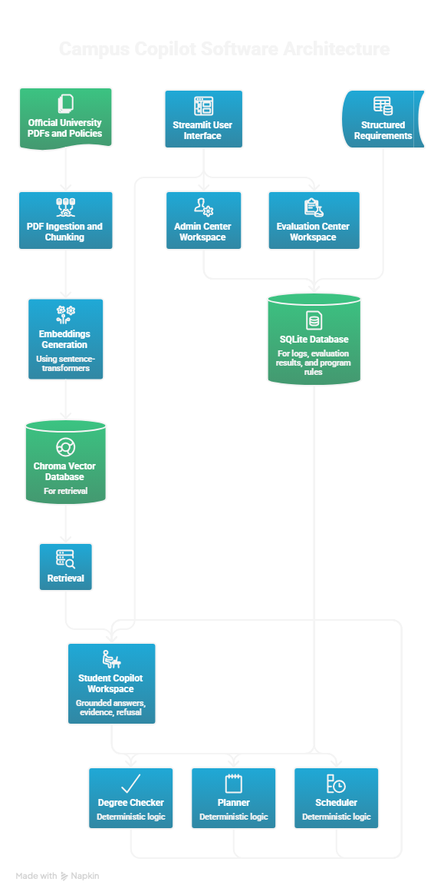

## Architecture


# Campus Copilot

Campus Copilot is a grounded academic copilot for advising Q&A, degree checking, planning, and schedule validation using official university documents and structured program rules.

## Architecture



## What it does
- Ingests official school documents into a local retrieval index
- Answers supported questions with evidence from source documents
- Refuses unsupported or weakly supported questions
- Provides an Admin Center for ingestion and diagnostics
- Provides an Evaluation Center for simple offline pass/fail checks
- Checks degree progress using structured program requirements
- Generates a deterministic term-by-term course plan
- Detects schedule conflicts using deterministic logic

## Why this project matters
Campus Copilot is designed to be more than a chatbot. It separates grounded document QA from deterministic academic logic.

- Document retrieval is used for supported question answering
- Structured rules are used for degree checking and planning
- Deterministic logic is used for schedule conflict detection
- Logs and evaluation make the system easier to inspect and improve

## Current workspaces
### Student Copilot
- grounded answer flow
- evidence panel
- refusal behavior
- retrieval debug view

### Admin Center
- school pack summary
- ingestion trigger
- recent ingestion runs
- recent logs

### Evaluation Center
- offline evaluation suite
- pass/fail summary
- grounded answer count
- correct refusal count

## Tech stack
- Python
- Streamlit
- Chroma
- SQLite
- PyPDF
- sentence-transformers
- pytest
- Git + GitHub

## Project structure
```text
campus-copilot/
  app/
    admin/
    core/
    eval/
    planner/
    rag/
    scheduler/
    school_packs/
    storage/
  docs/
  school_packs/
  tests/
  streamlit_app.py
